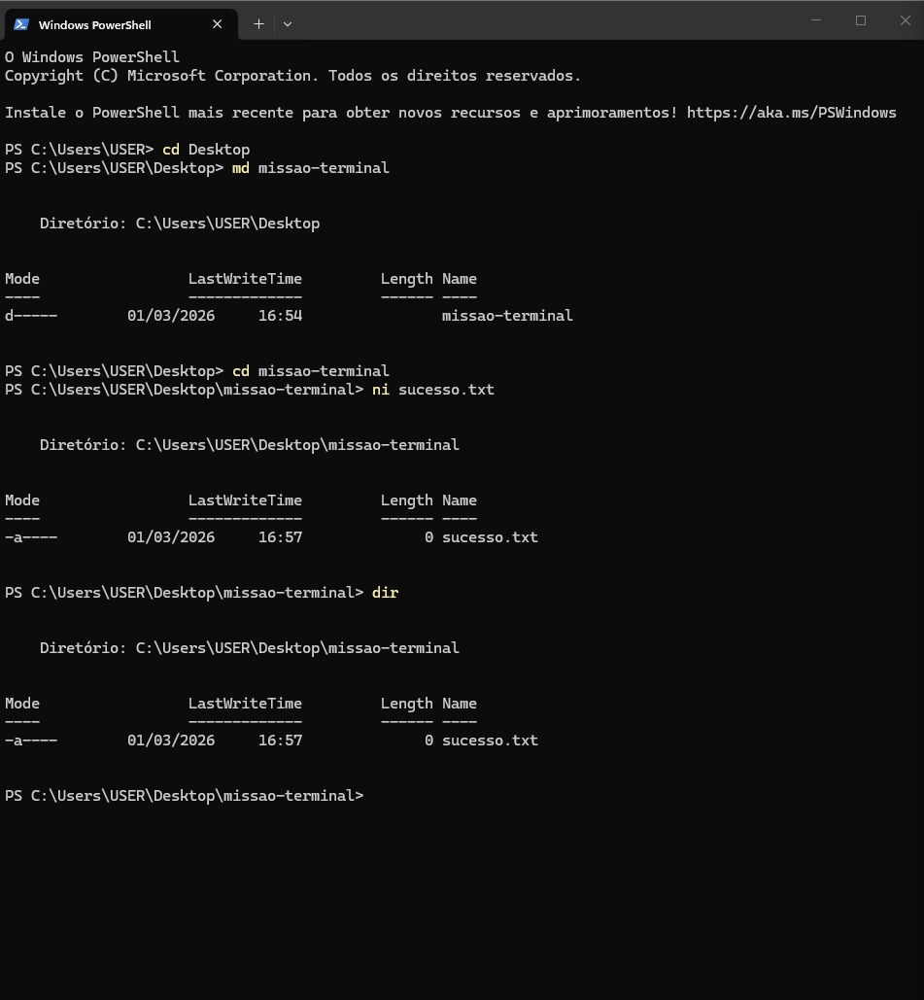

# ⚡ Meus Comandos Favoritos
Aqui estão os comandos que mais utilizei na aula de Terminal:

- `cd`: Para navegar entre pastas.
- `dir`: Para listar arquivos.
- `md` : Para criar a pasta.
- `ni` : Para criar o arquivo txt.

## 📸 Evidência de Execução

